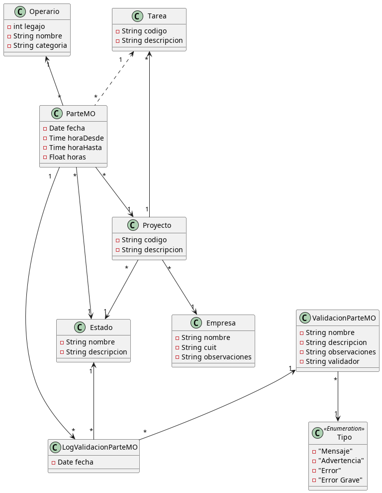

# Partes de Mano de Obra

Setup

Software necesario previamente

Instalar <a href="https://git-scm.com/download/linux">Git</a>

Instalar <a href="https://docs.docker.com/engine/install/ubuntu/">Docker</a> y <a href="https://docs.docker.com/compose/install/">Docker Compose</a>

¡CONFIGURACIÓN IMPORTANTE ANTES DE CONTINUAR!

No olvidar los pasos de post instalación para ejecutar docker sin priviliegios de root.

sudo groupadd docker

sudo usermod -aG docker $USER

Para hacer efectivos los cambios en los grupos, reiniciar la terminal o ejecutar

newgrp docker

Opcional: Para que docker no arranque de forma automática al inicio:

sudo systemctl disable docker.service

sudo systemctl disable containerd.service

Crear el archivo /etc/docker/daemon.json con el siguiente conenido:

{
  "userns-remap": "TU_NOMBRE_DE_USUARIO"
}

Editar los archivos /etc/subuid y /etc/subgid. Agregar la línea:

TU_NOMBRE_DE_USUARIO:1000:65536

Iniciar servicio docker sudo systemctl start docker

Este comando puede variar según la distro de linux utilizada.

Luego clonar este repositorio con la url ssh.

Ir al directorio clonado cd <repo_dir>

Dar permisos de ejecución al script lpl: chmod +x lpl.

Hacer el build de las imágenes Docker ./lpl build

Levantar los servidores ./lpl up

Verificar funcionamiento ingresando a http://localhost:4200/

---

## Problema planteado
*Brifal S.A.* es una empresa de servicios de ingeniería y construcción y basa su operatoria fundamentalmente en los trabajos de ingeniería orientados al uso intensivo de mano de obra.
Es por ello que el control, supervisión y gestión sobre este recurso es importarte para la sana economía de Brifal.
Por ello el presente sistema brindará a Brifal de una herramienta que le permita comenzar a transitar el camino de la gestión de aplicación y uso de horas de mano de obra.

## Objetivo de la Solución
Brindar a Brifal de una herramienta de control y gestión de los partes de mano de obra con la consiguiente gestión del personal.
Como resultado adicional a la cuestión operativa de esta aplicación Brifal contará con un tablero de gestión que le permita tomar decisiones y realizar mejoras en la gestión de ejecución de los proyectos.
Para ello es importante entender que esta solución es sólo una parte que se concentra exclusivamente en la gestión de la mano de obra de los proyectos.
A futuro se deberá considerar complementar el presente desarrollo informático con el resto de las actividades de un proyecto, como lo son su presupuestación, alquiler de equipos y el consumo de materiales.

## La solución requiere

### Administración de Información del Ambiente para organizar la información de los partes

#### Administración de Clientes.
La Aplicación contará con una administración Básica de los clientes y toda la información que sea de utilidad para realizar a posteriori análisis de información de gestión por diferentes segmentos de información.

#### Administración de personal.
La aplicación contará con una gestión de personal básica. Y una gestión de turnos de asignación al personal.

### Administración y Gestión de Partes de Mano de Obra
#### Carga de Partes de Mano de obra.
La solución basará su operatoria principal en la carga de los partes de manos de obra que serán asignados a los proyectos y vinculados a un legajo de personal.
Este módulo de la aplicación deberá realizar el mayor esfuerzo de programación para garantizar la agilidad y seguridad de operación del mismo.

#### Control Horario del personal.
La aplicación permitirá realizar control y gestión de horas asignadas a los proyectos analizando la información cargada.
Permitiendo de esta forma garantizar la calidad de información que brindará la aplicación.
Para ello la solución basada en parámetros, la configuración y los proyectos, analizará los posibles problemas de carga de datos, brindando una herramienta para limpiar posibles incongruencias.
* Implementar gestión de turnos del personal.

#### Auditoría sobre la gestión y modificación de los partes.
Para mejorar la gestión y los procedimientos sobre la gestión de partes la aplicación
registrará un histórico de cambios realizados sobre la información de los partes de mano
de obra, permitiendo de esta forma reconstruir y trazar la información operativa.

#### Control y corrección de partes por errores de carga.
La aplicación deberá soportar un mecanismo de ajuste de la información sin perder la cohesión. Para ello y soportado en la gestión de auditoría la aplicación garantizará modificaciones y correcciones consistentes en los partes de mano de obra.

